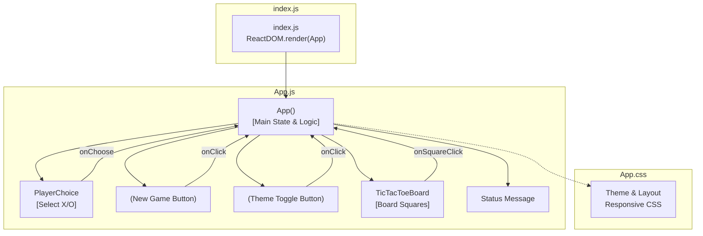

# Architecture Overview: Tic-Tac-Toe React Frontend

## Introduction

This document details the architecture of the frontend component for the classic Tic-Tac-Toe game implemented with React. The application offers a modern, accessible user interface, custom theming, and minimal dependency design. Its structure is intentionally straightforward and well-suited for maintainability and extensibility.

---

## High-Level Architecture

The application is a **Single-Page Application (SPA)**, served as static assets (HTML, CSS, JS). All UI logic, state management, rendering, and user interaction handling are encapsulated in the frontend.

At a high level, the application structure is as follows:
- **Entry Point:** `index.js` renders the root `<App />` React component.
- **Main Component:** `App.js` implements _all major game functions and state_.
- **Local UI Components:** Defined within `App.js` for modularity and simplicity, such as `TicTacToeBoard` and `PlayerChoice`.
- **Styling:** `App.css` (with CSS custom properties supporting theming and responsiveness).
- **Testing:** `App.test.js` provides basic UI render regression.

---

## Main Modules and Components

### 1. App Component (`App.js`)
- **Type:** Functional React Component
- **Purpose:** The root of UI and state logic.
- **Responsibilities:**
  - Holds all game state (board, turn, winner/draw, theme).
  - Handles theme switching.
  - Manages player side (X/O) selection.
  - Orchestrates game lifecycle (reset, new game, winner detection).
  - Provides keyboard accessibility (shortcuts for reset and theme toggle).
  - Renders UI: title, control bar (side select, new game, theme switch), game board, and status (turn/winner/draw).
- **Internal State:**
  - `theme`: Current theme (`light` or `dark`) reflected via the `data-theme` attribute and CSS variables.
  - `squares`: 9-element array for the board state.
  - `isX`: Boolean, current player (`true` for X, `false` for O).
  - `playerSide`: User-selected player side.
  - `status`: Textual game status (e.g., next turn, winner, draw).
  - `gameOver`: Boolean, indicates if the match is complete.
  - `winLine`: Indices of winning squares if a victory is detected.

### 2. TicTacToeBoard Component
- **Type:** Functional React Component (defined in `App.js`)
- **Props:** 
  - `squares`: (array) Board state
  - `onSquareClick`: (function) Handler for moves
  - `disabled`: (boolean) UI interactivity toggle
  - `winLine`: (array) Highlight for winning line squares
- **Purpose:** Presents a clickable 3×3 board and relays moves upwards.

### 3. PlayerChoice Component
- **Type:** Functional React Component (in `App.js`)
- **Props:** 
  - `onChoose`: (function) Side selection handler
  - `current`: (X/O) User's chosen side
  - `disabled`: (boolean) Disables selection post-game start
- **Purpose:** Lets user select X or O before starting a round.

### 4. Utility Function: calculateWinner
- Encapsulates logic for win/draw detection based on the current board state.
- Returns `{ winner, line }` for a win, or `{ draw }` for draw, or `null` for ongoing.

---

## Application Data Flow

The data flow is **unidirectional**, following React's recommended state management patterns:

1. **User interaction** (clicking board squares, buttons, or toggles) triggers event handlers in the App component.
2. Handlers update the appropriate portions of React state.
3. Updated state causes React to re-render components, presenting the latest information (e.g., marking board squares, updating status, disabling controls).
4. Winner or draw detection is automatically performed in a `useEffect` after each move, adjusting UI and interactivity as needed.

### Data/Component Flow Diagram

---

## Architectural Patterns

- **Component-Oriented:** All interactive units are React components (function components), focused on clear, encapsulated responsibilities.
- **Unidirectional Data Flow:** State is managed in the root App component and passed down as props. Child components are stateless or receive callbacks to interact.
- **Local-Only State:** No external state management libraries; all game, theme, and UI state are handled within React's `useState`.
- **Side Effects:** `useEffect` manages non-UI side effects (e.g. DOM theme, game eval, keyboard events).
- **Styling via CSS Variables:** Theming leverages CSS custom properties, allowing for dynamic light/dark toggling via a root-level attribute.
- **Accessibility:** Use of `aria-*` attributes, `tabIndex`, and keyboard event listeners for accessible navigation and interaction.

---

## Key React Patterns & Practices

- **Hooks**: Utilizes `useState` for state and `useEffect` for effects and side-effects.
- **Single Responsibility**: Each helper/component in `App.js` is focused on a single UI function (board rendering, player select, game state).
- **Testability**: Modular layout and atomic functions/components improve maintainability and testability.
- **No Context or Redux**: The simplicity of the game does not require context or global state.

---

## Extensibility

- **Adding Features:** New settings (e.g., scoreboard, AI opponent) can be added by expanding App state or modularizing boards.
- **Style Customization:** Easy to retheme by editing `App.css` or adding new variables/modes.
- **Component Extraction:** Additional UI widgets or detail panels may be promoted to their own files/components as complexity grows.

---

## Dependencies and Build Context

- **React 18**: Core UI framework (`react`, `react-dom`)
- **react-scripts**: Project scaffolding, dev tools, hot reload, and build
- **No heavy UI framework**: All UI is vanilla CSS or basic React
- **cross-env**: For environment variable scripts (dev only)

---

## Summary

This architecture favors clear, idiomatic React with local state and modular, functional components. The code is intentionally minimalist and accessible, intended as a solid basis for further expansion, customization, or adaptation to other classic games or simple SPAs.

---

### Sources

- tic-tac-toe-classic-147845/tic_tac_toe_frontend/src/App.js
- tic-tac-toe-classic-147845/tic_tac_toe_frontend/package.json
- tic-tac-toe-classic-147845/tic_tac_toe_frontend/README.md
- tic-tac-toe-classic-147845/tic_tac_toe_frontend/src/App.css

